### Elementrem Token(Coin) contract

You can use Elementrem to create a new coin. It is very easy and fast to deploy, and above all, you can use your Coin in a wide variety of areas. All of these work in the Elementrem ecosystem.

It is called Token (Coin) for you to explain easily, but basically it deals with a `numbers` which has a meaning and purpose.
It can be used for `counting and voting` very simply, and furthermore it can be used for `accounting, stock issuance`, as well as replacing existing `national currency with ELE token`.    
All of these can be achieved using the decentralization of the Elementrem ecosystem to achieve high reliability, safety and security.

***
- Deploying a simple Token(Coin) contract Lab - Step by Step
***

**1. Run the Elementrem Mist Wallet, click on `Contracts Tab`, and go to `deploy new contract.`**
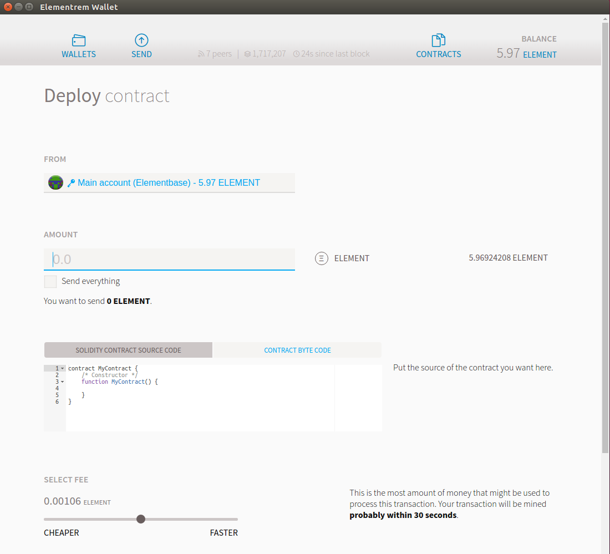
You do not have to write `Element Amount`. All contracts require only gas(commission).     
      
------------------------------      
      
**2. Write the `solidity contract source code.`**     
Copy and paste the following code very simply.
```
pragma solidity ^0.4.10;
contract tokenRecipient { function receiveApproval(address _from, uint256 _value, address _token, bytes _extraData); }

contract MyToken {
    /* Public variables of the token */
    string public standard = 'Token 0.1';
    string public name;
    string public symbol;
    uint8 public decimals;
    uint256 public totalSupply;

    /* This creates an array with all balances */
    mapping (address => uint256) public balanceOf;
    mapping (address => mapping (address => uint256)) public allowance;

    /* This generates a public event on the blockchain that will notify clients */
    event Transfer(address indexed from, address indexed to, uint256 value);

    /* Initializes contract with initial supply tokens to the creator of the contract */
    function MyToken(
        uint256 initialSupply,
        string tokenName,
        uint8 decimalUnits,
        string tokenSymbol
        ) {
        balanceOf[msg.sender] = initialSupply;              // Give the creator all initial tokens
        totalSupply = initialSupply;                        // Update total supply
        name = tokenName;                                   // Set the name for display purposes
        symbol = tokenSymbol;                               // Set the symbol for display purposes
        decimals = decimalUnits;                            // Amount of decimals for display purposes
    }


/* Send coins */
    function transfer(address _to, uint256 _value) {
        if (balanceOf[msg.sender] < _value) throw;           // Check if the sender has enough
        if (balanceOf[_to] + _value < balanceOf[_to]) throw; // Check for overflows
        balanceOf[msg.sender] -= _value;                     // Subtract from the sender
        balanceOf[_to] += _value;                            // Add the same to the recipient
            Transfer(msg.sender, _to, _value);                   // Notify anyone listening that this transfer took place
    }

    /* Allow another contract to spend some tokens in your behalf */
    function approve(address _spender, uint256 _value)
        returns (bool success) {
        allowance[msg.sender][_spender] = _value;
        return true;
    }

        /* Approve and then comunicate the approved contract in a single tx */
    function approveAndCall(address _spender, uint256 _value, bytes _extraData)
        returns (bool success) {
        tokenRecipient spender = tokenRecipient(_spender);
        if (approve(_spender, _value)) {
            spender.receiveApproval(msg.sender, _value, this, _extraData);
            return true;
        }
    }        

    /* A contract attempts to get the coins */
    function transferFrom(address _from, address _to, uint256 _value) returns (bool success) {
        if (balanceOf[_from] < _value) throw;                 // Check if the sender has enough
        if (balanceOf[_to] + _value < balanceOf[_to]) throw;  // Check for overflows
        if (_value > allowance[_from][msg.sender]) throw;   // Check allowance
        balanceOf[_from] -= _value;                          // Subtract from the sender
        balanceOf[_to] += _value;                            // Add the same to the recipient
        allowance[_from][msg.sender] -= _value;
        Transfer(_from, _to, _value);
        return true;
    }

    /* This unnamed function is called whenever someone tries to send ether to it */
    function () {
        throw;     // Prevents accidental sending of ether
    }
}
```       
      
------------------------------      
      
**3. Specify the parameters.**      
On the right column you'll see all the parameters you need to personalize your own token. You can tweak them as you please.     
Scroll to the end of the page and you'll see an estimate of the computation cost of that contract and you can select a fee on how much ether you are willing to pay for it. Any excess ether you don't spend will be returned to you so you can leave the default settings if you wish. Press "deploy", type your account password and wait a few seconds for your transaction to be picked up.

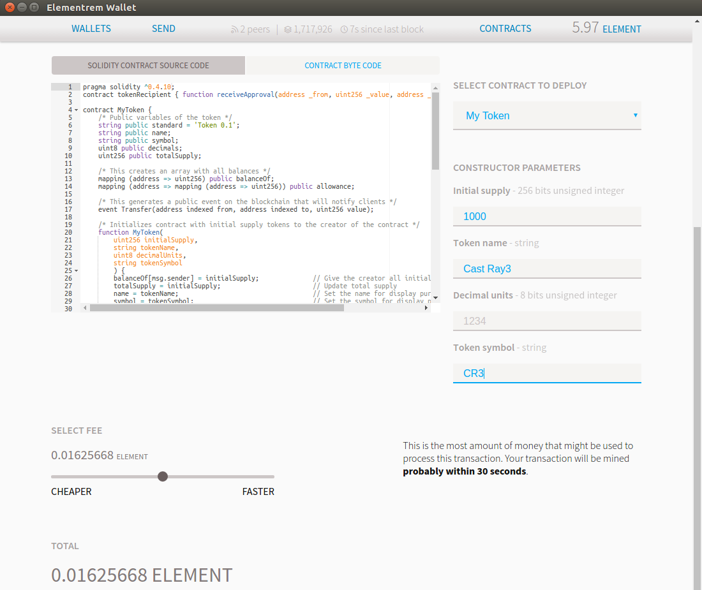      
      
------------------------------      
      


**4. Deploy Contract.**     
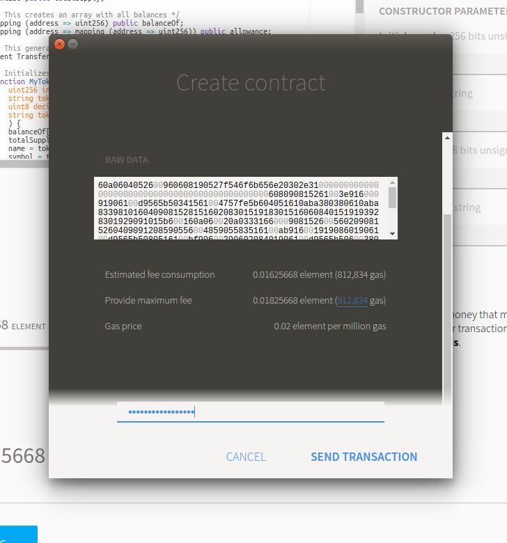      
      
------------------------------      
      

**5. Waiting for confirmation**     
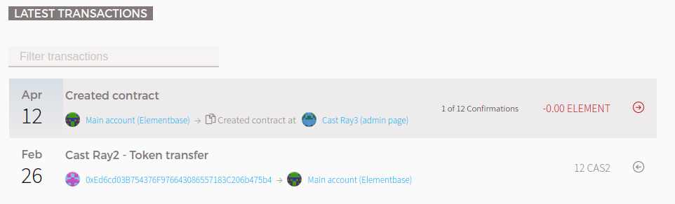
You'll be redirected to the front page where you can see your transaction waiting for confirmations. Click the account named `Element base` and after no more than a minute you should see that your account will show that you have 100% of the shares you just created.     
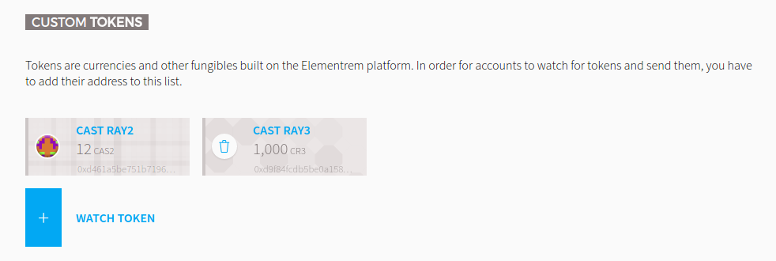    
      
------------------------------      
      

**6. Identify the address of the Token Contract.**      
Now go to the `Contracts tab` and Click on Token created in `CUSTOM TOKENS` to see Token information.     
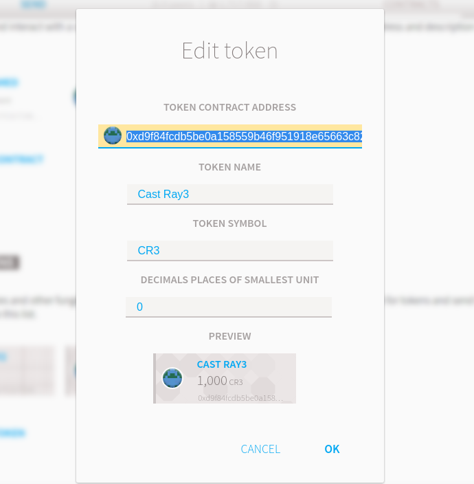      

Since this is a very simple Token informatio page there isn't much to do here, just copy `contract address`.
This address exists forever in the Elementrem ecosystem, which allows other users to add the Token to their wallet.     
      
------------------------------      
      

**7. Add the generated Token to another user's wallet.**  
Other users will not see anything in their wallet yet. This is because the wallet only tracks tokens it knows about, and you have to add these manually. 
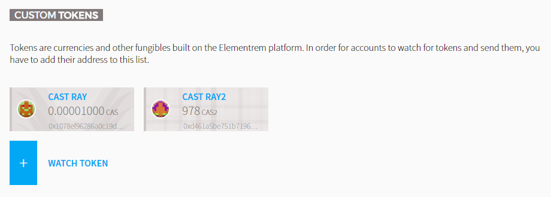    
Now go to the `Contracts tab` and Click on `Watch token` in the` CUSTOM TOKENS` menu.

To add a token to watch, go to the contracts page and then click "Watch Token". A pop-up will appear and you only need to paste the contract address.   
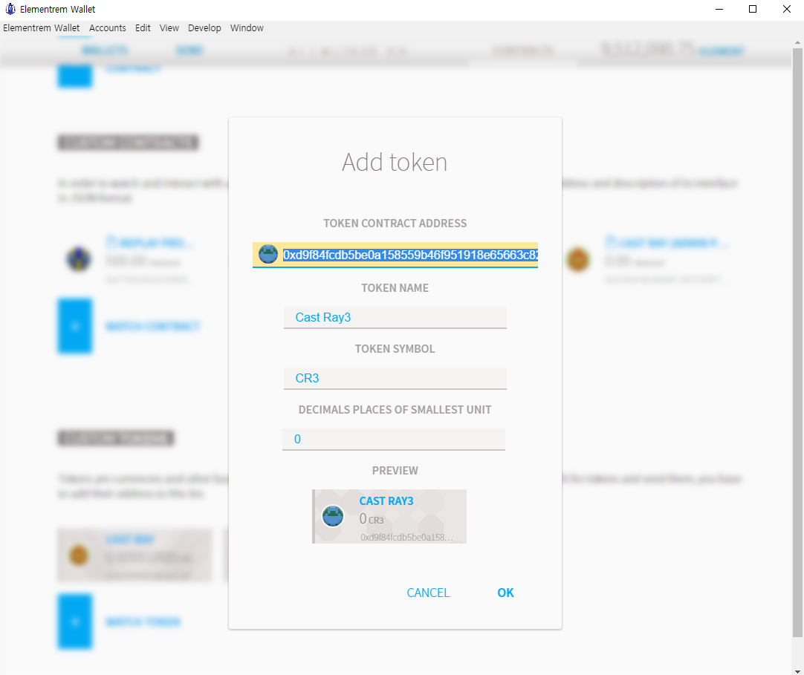    

From now on, other users can use tokens.
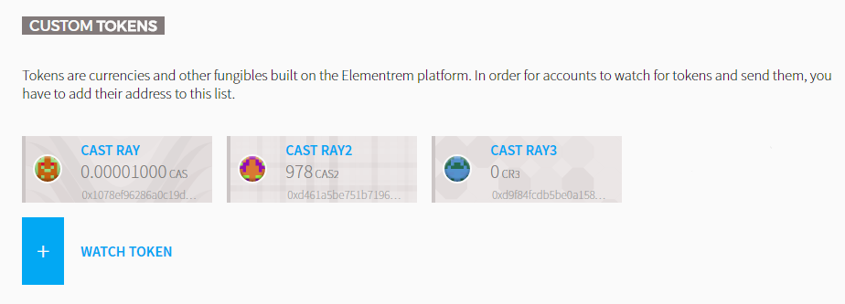    
      
------------------------------      
      


***Congratulations! Both the user who created the token and the user who added the token can see a menu that allows them to select and send tokens.***      
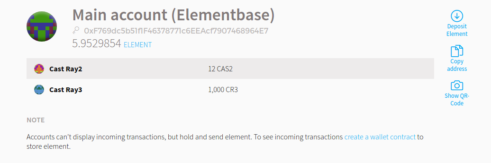   
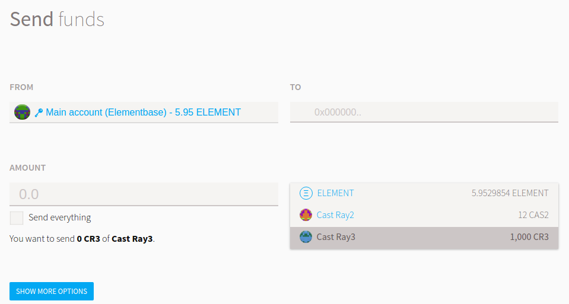 


* Tracking of the Token will be activated in the new BlockExplorer, which will be launched in December.
